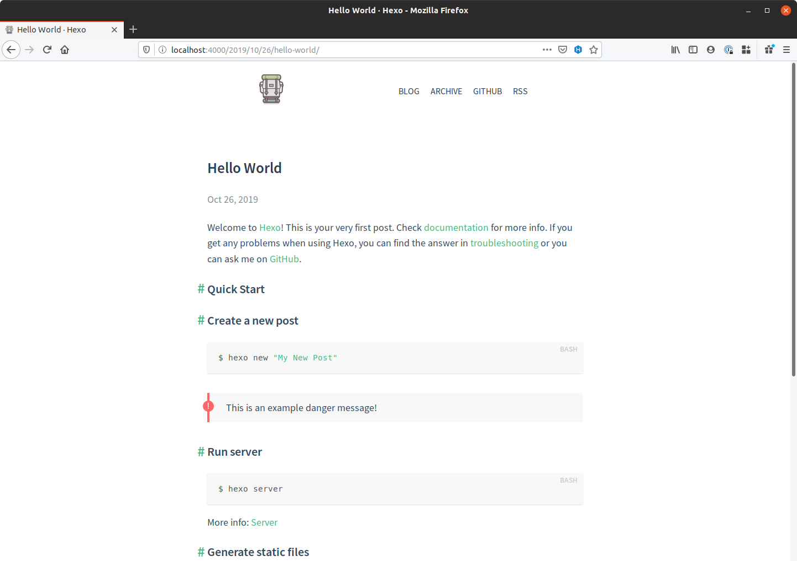

# Hexo Theme Hermes



## Getting Started

You can get up and running quickly with this hexo theme by running the following commands

```bash
# Generate new blog
hexo init blog
cd blog

# Install Hermes theme
git clone https://github.com/claymcleod/hexo-theme-hermes.git themes/hermes
sed -i.bak "s/theme: landscape/theme: hermes/g" _config.yml && rm _config.yml.bak
rm -r themes/landscape

# Install required plugins
npm i hexo-renderer-pug --save

# Install recommended plugins
npm i hexo-generator-feed \
      hexo-generator-feed \
      hexo-generator-sitemap \
      hexo-browsersync \
      hexo-generator-archive \
      --save

# Set some nice-to-have configuration options
sed -i.bak 's/relative_link: false/relative_link: true/g' _config.yml && rm _config.yml.bak

# Start the hexo server
hexo server
```
To update your copy of the theme at any time, simply do

```bash
cd themes/hermes
git pull
```

## Documentation

You can find relevant documentation in the `docs/` folder. Specifically, you might be interested in docs on:

* [Configuration](docs/configuration.md)

## Contributing

Pull requests are welcome. For major changes, please open an issue first to discuss what you would like to change.

Please make sure to update tests as appropriate.

## Authors and Acknowledgments

This theme was forked and modified moderately from [pinggod's](https://github.com/pinggod) [hexo-theme-apollo](https://github.com/pinggod/hexo-theme-apollo) repo. I owe them a lot of credit for creating the foundation for this theme.

## License

[MIT](https://choosealicense.com/licenses/mit/)