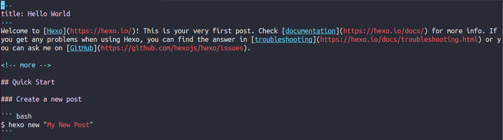
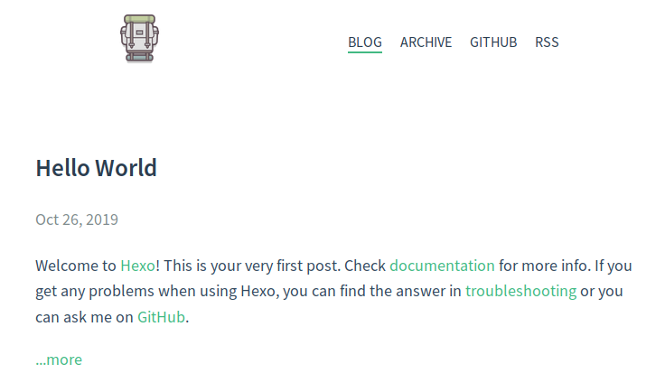
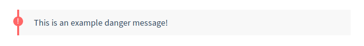

# Table of Contents <!-- omit in toc -->

- [Meta Descriptions](#meta-descriptions)
- [Titles](#titles)
- [Displaying Post Previews](#displaying-post-previews)
- [Comments](#comments)
- [Danger Block](#danger-block)
- [Archives](#archives)

## Meta Descriptions

If you want to set meta description information, please set `desc` property and value to each post — the better method is setting default `desc` property to your scaffolds files, just like:

```md
title: Lorem ipsum dolor
date: 2015-12-31 14:49:13
desc: Lorem ipsum dolor sit amet, consectetur.
---

Lorem ipsum dolor sit amet, consectetur adipisicing elit. Totam, non numquam saepe ex ut. Deleniti culpa inventore consectetur nam saepe!
```

result:

```html
<meta name="description" content="Lorem ipsum dolor sit amet, consectetur.">
```

If there is no `desc` property or value, hexo-theme-hermes will use `page.title` and `page.author` instead of it. 

## Titles

`hexo-theme-hermes` supports two kinds of titles:

* `h1` through `h3` elements are treated the same as "large" titles.
* `h4` through `h6` elements are treated the same as "small" titles.

The idea is to keep the structure of the blog post simple and readable rather than nesting multiple layers and distracting from the content. The original author of the `hexo-theme-apollo` theme was the individual that made that decision, and I have inherited it here.

## Displaying Post Previews 

If you wish to include some text as a preview of the article on the blog index, you can include the `<!-- more -->` statement. All content before the `<!-- more -->` statement will be parsed and shown in your index.

If you want to show excerpt(core content of article) to your visitors, do add HTML comment tag `<!--more-->` before else content，and finally the tag will be parsed to be a variable which represents post excerpt by Hexo:




## Comments

Hexo-theme-hermes supports comment plugins for Disqus. please set like this in your `themes/hermes/_config.yml`:

```yaml
disqus: claymcleod
```

## Danger Block

Use html tag with special class property to render block:

```html
<div class="danger">
This is an example danger message!
</div>
```



## Archives

You can modify the `/archives/` section of the site by included any of the [hexo-generator-archive](https://github.com/hexojs/hexo-generator-archive) options to your `_config.yml` file under `theme`.

```
archive_generator:
    per_page: 0
    yearly: false
    monthly: false
    daily: false
```